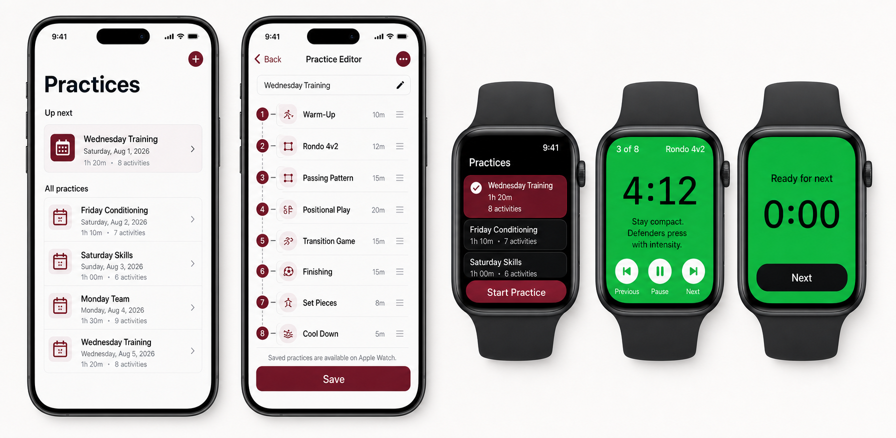
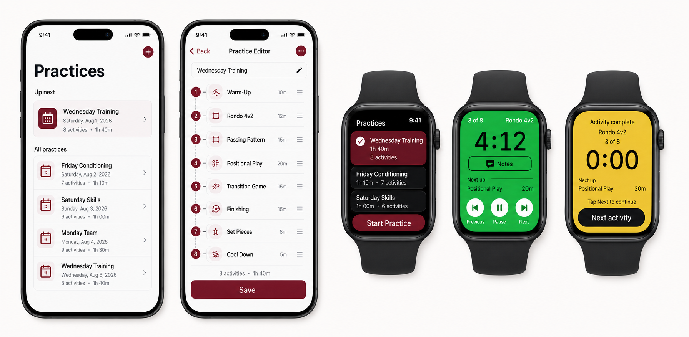
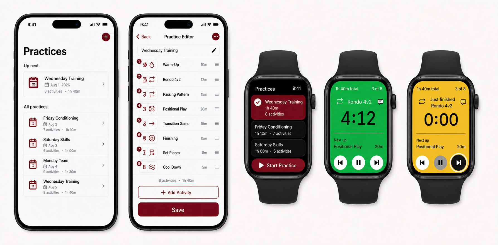
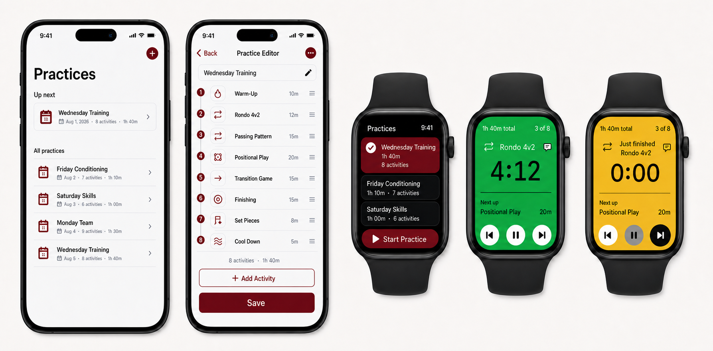
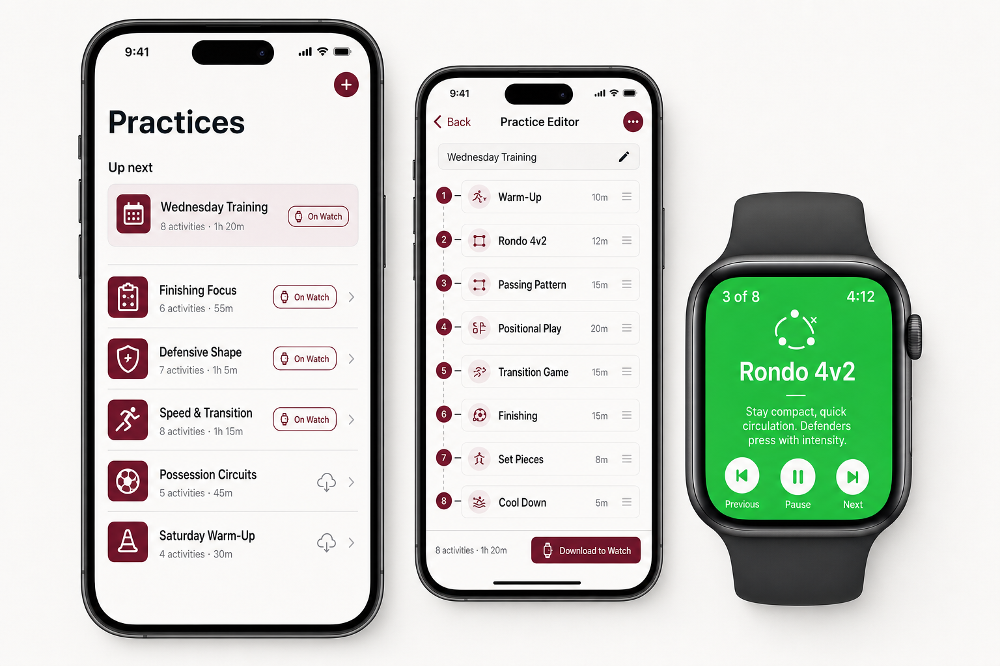
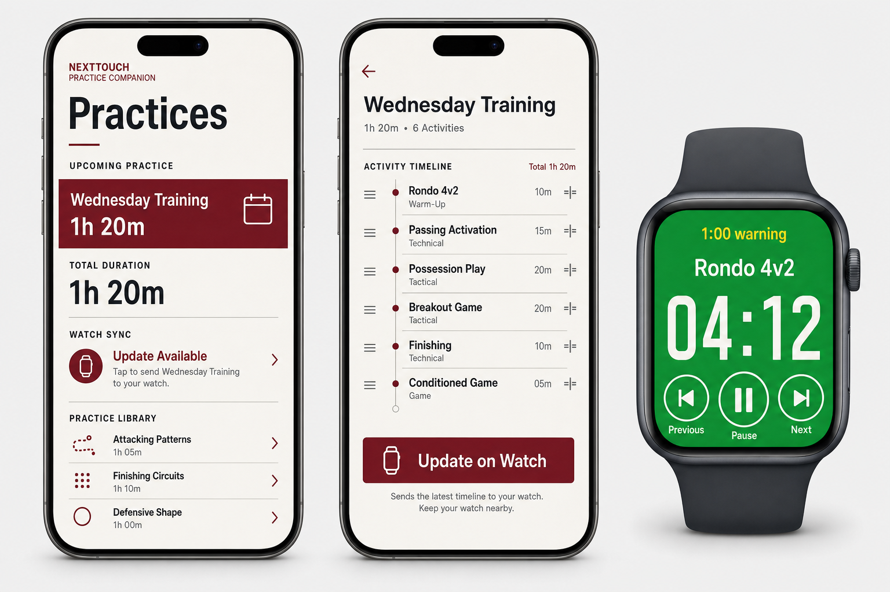
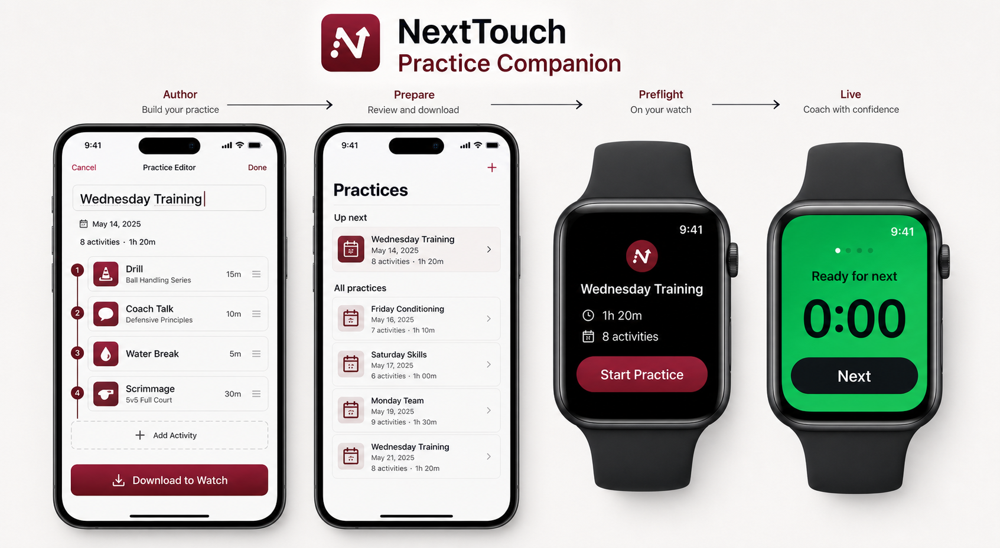

# NextTouch Practice Companion mockups

Three visual directions based on `NEXTTOUCH_PRACTICE_COMPANION_PLAN.md`.

## Revised composite

This revision combines the selected parts of the original concepts:

- Practices layout follows the utility-first list structure.
- Practice Editor follows the editorial timeline treatment.
- `Save` is the single phone action and implicitly syncs the immutable practice snapshot to Apple Watch.
- The watch can hold multiple saved practices and lets the coach choose one before starting.
- Live watch mode is solid green with the timer and coaching notes, without an activity icon or illustration.
- The expired `0:00` state keeps the coach there until they manually tap `Next`.

## Revised v2

This pass tightens the live watch experience:

- Live mode is condensed to show the timer, current activity, a labeled `Notes` control, and `Next up`.
- Coaching notes are no longer inline, so longer content can live behind the control.
- The complete state changes to warm amber and explains `Activity complete`, the current position, and the next activity.
- Watch faces use natural proportions instead of elongated presentation renders.
- The editor footer now shows the recalculated `8 activities · 1h 40m` total for the listed durations.

## Revised v3

This pass adds the interaction details from the latest review:

- Active Watch mode shows `1h 40m total`, `3 of 8`, the current activity icon/title, `Notes`, and `Next up`.
- Transport controls are icon-only; `Start Practice` uses a play icon.
- The amber completion state says `Just finished Rondo 4v2` and uses a next icon on `Next activity`.
- The editor includes a visible `+ Add Activity` button.
- Activity icons follow reusable drill categories from the plan rather than unique drill artwork.

## Revised v4

This pass focuses on density and fixed actions:

- Practice Library rows use compact date + duration metadata with a small calendar glyph.
- Editor rows combine the sequence number with the category icon to recover horizontal space.
- The timeline is treated as the scrolling region; the footer stays fixed in the order summary, `+ Add Activity`, then `Save`.
- Live Watch mode uses a smaller current-activity icon and compact Notes affordance.
- The amber completion state mirrors the active layout, greys out the center control, and highlights Next as the clear action.

## Revised v5

This correction pass:

- Restores the separate numbered timeline rail and category icon treatment.
- Condenses every Practice Library event into a compact two-line row with inline date, activity count, and duration metadata.
- Removes the white ring from the expired-state Next control while keeping it visually emphasized.

## Option 1 — Editorial coach

The most balanced direction: calm iPhone authoring surfaces with maroon accents, paired with a highly legible full-green watch practice mode.

## Option 2 — Utility-first

The densest and most operational direction: stronger typographic hierarchy, explicit sync status, and a very large watch timer for quick glances.

## Option 3 — Timeline-first

The clearest end-to-end story: author on iPhone, prepare and download, preflight on watch, then coach in live mode. The activity rail becomes the main organizing motif.

## Shared decisions carried across all options

- iPhone owns practice authoring and watch download.
- Watch owns the active run and remains usable offline.
- Live watch mode is full-bleed green with a dominant timer.
- Previous, Pause/Resume, and Next are large one-tap controls.
- The iPhone uses a neutral paper/white surface with NextTouch maroon for brand actions.
